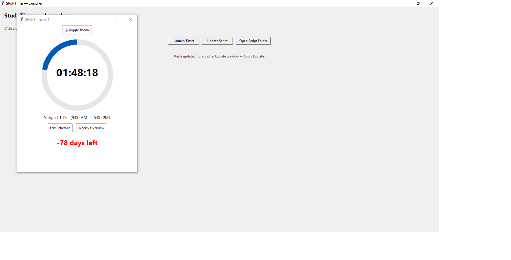
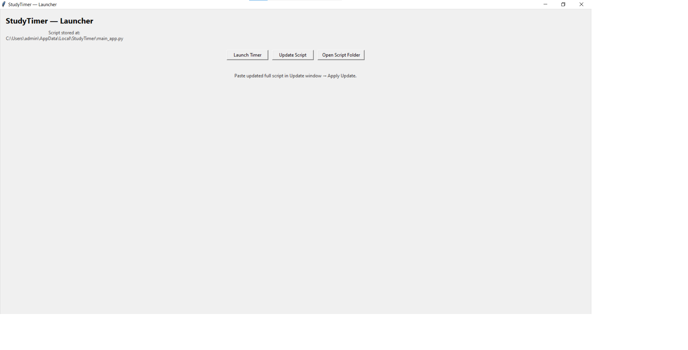

# StudyTimer

## Overview

StudyTimer is a Python-based study planning and countdown application designed to help users manage daily schedules, track study sessions, and monitor the time remaining until important target dates and examinations.

The application combines schedule management, countdown tracking, theme customization, and weekly planning features within a single desktop interface.

---

## Key Features

- Live countdown timer for current study activity
- Exam and target date countdown tracking
- Daily study schedule management
- Weekly overview dashboard
- Light and Dark theme support
- Customizable timetable and activity planning
- Simple and user-friendly desktop interface

---

## Screenshots

### Study Timer Dashboard

### Study Timer Launcher

---

## Technologies Used

- Python
- Tkinter
- JSON
- Datetime
- Threading

---

## Use Cases

- Exam preparation planning
- Daily study schedule tracking
- Productivity monitoring
- Goal and target date management
- Time management during intensive study periods

---

## Future Improvements

- Study analytics dashboard
- Subject-wise performance tracking
- Progress reports and charts
- Cloud backup and synchronization
- Mobile companion application

---

## Author

**Mustakim Khan**

Personal Automation Project built using Python for learning automation, productivity, and workflow management concepts.
